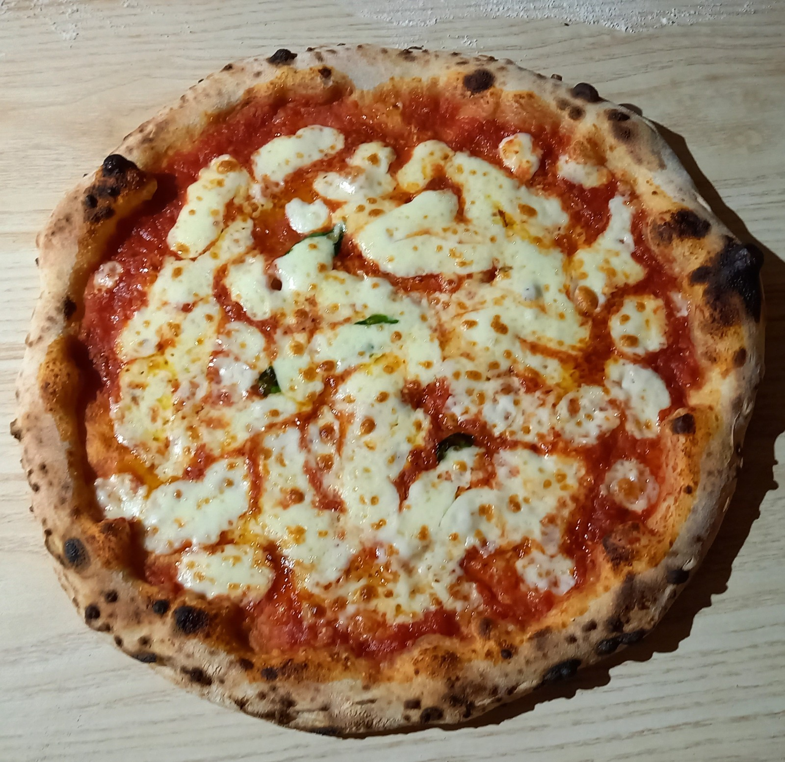

# the picture and text component?

```
<section class="container mx-auto px-6 py-2 max-w-3xl"><div class="flex items-center flex-wrap mb-20"><div class="w-full sm:w-1/2 mx-auto sm:mx-0"><h4 class="text-center md:text-left text-3xl text-gray-800 font-bold mb-3">Paolo's Pizza is a new Pizza delivery service based in Marple, UK.</h4><p class="text-center md:text-left text-gray-700 mb-8">We offer delicious, hand stretched Pizza, made in the authentic Neapolitan style and delivered directly to your door.</p></div><div class="w-full sm:w-1/2 mx-auto sm:mx-0"></div></div><div class="flex items-center flex-wrap mb-20"><div class="w-full sm:w-1/2 mx-auto sm:mx-0"></div><div class="w-full sm:w-1/2 mx-auto sm:mx-0"><h4 class="text-center md:text-left text-3xl text-gray-800 font-bold mb-3">When you can't go to the Pizzeria,</h4><p class="text-center md:text-left text-gray-700 mb-8">let the Pizzeria come to you!</p></div></div></section>
```

# social links

```
<!--                    <li class="mt-2">-->
<!--                        <a href="https://instagram.com/{{ site.instagram_username| cgi_escape | escape }}"-->
<!--                           class="hover:underline text-gray-700 hover:text-orange-500">-->
<!--                            <span class="username">paolospizzamarple</span>-->
<!--                        </a>-->
<!--                    </li>-->

<!--                    <li class="mt-2">-->
<!--                        <a href="https://www.twitter.com/{{ site.twitter_username| cgi_escape | escape }}"-->
<!--                           class="hover:underline text-gray-700 hover:text-orange-500">-->
<!--                            <span class="username">paolospizzamarple</span>-->
<!--                        </a>-->
<!--                    </li>-->
```